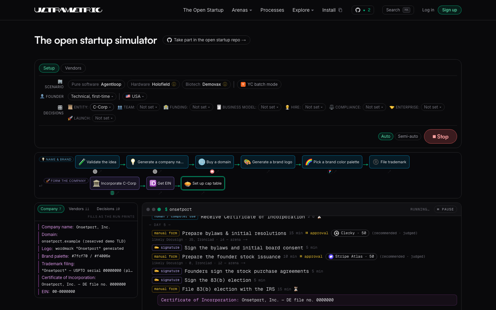
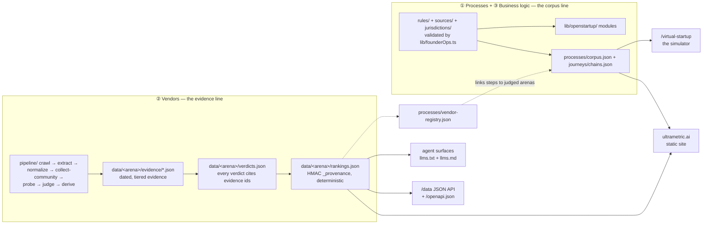
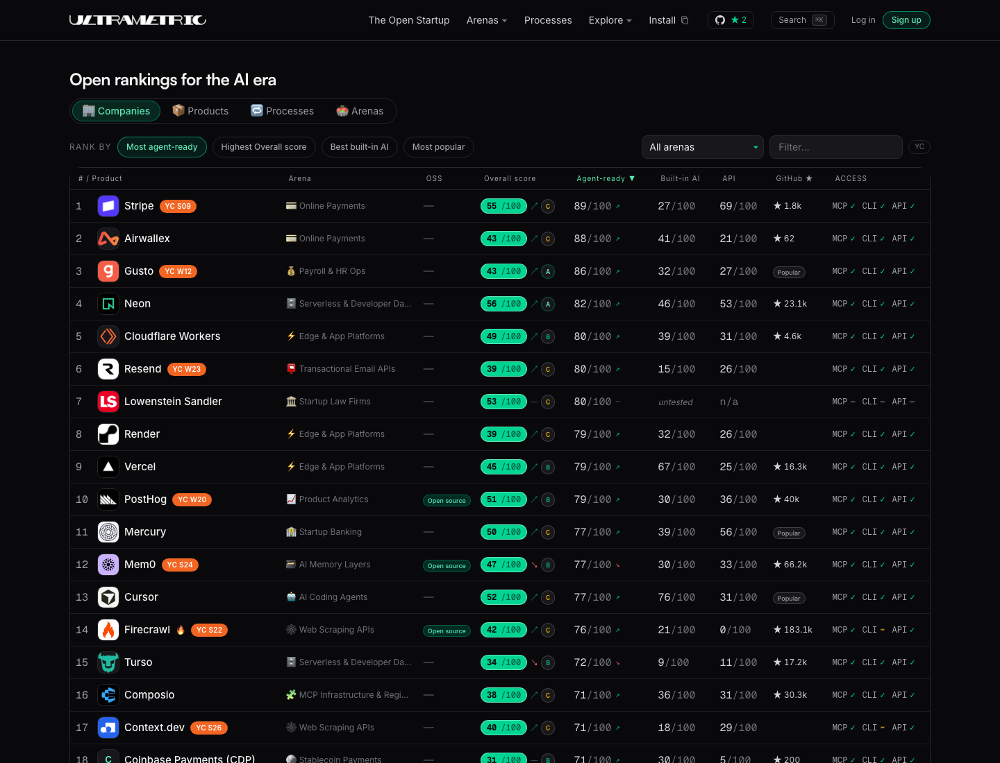

# Ultrametric — the open startup repo

[](https://github.com/ultrametricai/ultrametric/actions/workflows/ci.yml)
[](https://ultrametric.ai)
<!-- stat-badges:start -->
[](https://ultrametric.ai)
[](https://ultrametric.ai/everything)
[](https://ultrametric.ai/methodology)
<!-- stat-badges:end -->
[](./LICENSE)
[](./DATA-LICENSE)

**The open startup repo: a source-backed operating map for starting and running a company,
anywhere.** Everything here is a dated, citable, testable record — never opinion — organized
into three pillars: **[processes](#-processes)** (what a founder does, step by step),
**[vendors](#-vendors)** (which tools actually deliver, with evidence), and
**[business logic](#-business-logic)** (the rules and calculations underneath). Built to be
extended by founders everywhere, one pull request at a time.



*[The Open Startup](https://ultrametric.ai/virtual-startup) mid-run: a simulated company
(every artifact visibly SIMULATED) executing the real corpus — incorporation filings, 83(b)
elections, EIN — with each step routed agent / manual form / human and vendors drawn from the
judged rankings.*

Live site: https://ultrametric.ai (rankings at [/overall](https://ultrametric.ai/overall),
processes at [/processes](https://ultrametric.ai/processes))

<!-- stats:start -->
As of the last full pipeline run: **94 arenas, 593 products, 33,789 judged verdicts.**
<!-- stats:end -->

Arena, product, and verdict counts above (and in the badge row) are regenerated from data/ by
`pnpm stats` — never a hand-maintained claim; see "Status & roadmap" for what's next.

> ⭐ **If an open, evidence-based operating map for founders is useful to you,
> [star the repo](https://github.com/ultrametricai/ultrametric)** — stars are how other
> founders find this, and every record here is open for you to audit, contest, or extend.

## Start here

Three pillars, three ways in. Pick the row that matches what you came for.

**You're a founder starting or running a company:**

| What you need | Where |
| --- | --- |
| What do I actually have to do, step by step? | [/processes](https://ultrametric.ai/processes) — 123 processes grouped by area, each with its agent ceiling; chained playbooks (incorporate → launch, the VC raise, agent-run back office) on the same page |
| Watch a whole company run the corpus | [/virtual-startup](https://ultrametric.ai/virtual-startup) |
| Which tools are best — and agent-ready? | [/overall](https://ultrametric.ai/overall) rankings · [per-arena leaderboards](https://ultrametric.ai/arenas) (each arena at `/arena/<id>`) · [/compare](https://ultrametric.ai/compare) |
| Proven toolchains to copy | [/stacks](https://ultrametric.ai/stacks) |
| Deadlines, cap-table math, runway, offer scenarios | [`business-logic/`](business-logic/README.md) — source-cited, exhaustively tested modules in [`lib/openstartup/`](lib/openstartup/) |
| Does this work outside the US? | the geo switcher on process/product pages (US · UK · IN · DE · FR); to add your country, see [Add your country or state](#add-your-country-or-state) |

**You want to contribute:**

```bash
git clone https://github.com/ultrametricai/ultrametric.git && cd ultrametric
pnpm install
pnpm dev        # http://localhost:3000
pnpm test
```

| You want to | Where |
| --- | --- |
| Contest a verdict | the "⚑ contest" link next to any verdict on the site → [prefilled issue](https://github.com/ultrametricai/ultrametric/issues/new?template=contest-verdict.yml); flow in [CONTRIBUTING.md](./CONTRIBUTING.md) |
| Add evidence or prove a story hands-on | [CONTRIBUTING.md](./CONTRIBUTING.md) · [`docs/PROVE-IT.md`](./docs/PROVE-IT.md) |
| Add your product to an arena | [/submit](https://ultrametric.ai/submit) or [CONTRIBUTING.md § Add your product](./CONTRIBUTING.md#3-add-your-product) |
| Add your country or state | [Add your country or state](#add-your-country-or-state) below — four PR shapes, smallest first |
| Add a business-logic module | [`business-logic/README.md`](business-logic/README.md) — the bar: pure functions, a citation on every formula, tests that double as documentation |
| Understand the review bar | [governance/REVIEW_POLICY.md](governance/REVIEW_POLICY.md) |

**You're an agent or developer consuming the data** — nothing to install, no auth:

```bash
curl https://ultrametric.ai/data/categories.json           # every arena
curl https://ultrametric.ai/data/ai-coding/rankings.json   # any arena, machine-readable
curl https://ultrametric.ai/arena/ai-coding/llms.md        # same arena, markdown for agents
curl https://ultrametric.ai/llms.txt                       # the index for agents
```

Every shape is published as a JSON Schema in [`schemas/`](schemas/), the endpoints are
described by [/openapi.json](https://ultrametric.ai/openapi.json), and the ground rules are in
[governance/AGENT_POLICY.md](governance/AGENT_POLICY.md). More in
[For AI agents](#for-ai-agents) below. (A first-party Ultrametric MCP server + API is coming;
the JSON data API and llms.txt/llms.md surfaces are the supported ways in.)

## The three pillars

### ① Processes

**What it is.** The operational corpus: 123 step-by-step founder processes, each a DAG whose
every step is routed agent / manual form / human, with per-step reversibility
(reversible / painful / irreversible), vendor options drawn from the judged rankings, time
estimates, and — on 38 steps — named method variants (e.g. the per-country filing routes).
Every process carries an honest **agent ceiling** (`full` / `partial` / `manual_guide`: what an
agent can actually run today), and 44 processes carry per-country geo notes (UK, India,
Germany, France; the US is the baseline). 24 playbooks chain processes into founder paths —
incorporate → launch, the VC raise, the agent-run back office.

**Where it lives.** [`processes/`](processes/) (`corpus.json` + the jurisdiction-scoped legal
workflows), [`journeys/`](journeys/) (`chains.json`), and
[`processes/vendor-registry.json`](processes/) (every vendor fact the process pages render).

**Live.** [/processes](https://ultrametric.ai/processes) (each process at `/processes/<id>`),
and [The Open Startup](https://ultrametric.ai/virtual-startup) — a simulator that replays the
whole corpus as a simulated company, end to end.

**Extend it.** Add a `geoNotes` country analog, a new process from
[`templates/`](templates/), or a chain — all schema-gated by `pnpm test`. Start at
[`processes/README.md`](processes/README.md) and [`journeys/README.md`](journeys/README.md).

### ② Vendors

**What it is.** The evidence layer: head-to-head, evidence-graded rankings of the tools
startups run on — 94 arenas, 593 products, 33,789 judged verdicts over 32,480 dated evidence
items (committed counts, 2026-10-01). Every verdict cites dated evidence (vendor docs, GitHub,
community sources, hands-on probes), rankings recompute bit-identically and carry HMAC
`_provenance`, honest negatives count as much as positives, and owner-affiliated products are
disclosed and adversarially bias-audited
([evidence doctrine](governance/REVIEW_POLICY.md) · [METHODOLOGY.md](./METHODOLOGY.md)).

**Where it lives.** [`data/`](data/) (per-arena products, stories, evidence, verdicts,
rankings), [`vendors/`](vendors/) (the doctrine + `reviews/generated/` — one dated interchange
record per judged product, 593 today), and
[`processes/vendor-registry.json`](processes/) (the bridge that links process steps to judged
arenas).

**Live.** [/overall](https://ultrametric.ai/overall) and every arena at
`/arena/<id>` (index at [/arenas](https://ultrametric.ai/arenas)).

**Extend it.** Contest a verdict, add evidence, prove a story, or submit a product — see
[Contributing](#contributing--how-the-community-can-help). Start at
[`vendors/README.md`](vendors/README.md).

### ③ Business logic

**What it is.** The rules and calculations a startup actually runs on, as open,
source-cited, exhaustively tested records and code:

- **Rule cards** — [`rules/`](rules/): 12 dated legal propositions (10 US-FED, 2 US-DE), one
  stable ID each, every `kind: legal` card citing a primary authority in
  [`sources/`](sources/) with an exact provision locator. Status `demonstration` — honest
  maturity, stated on the card.
- **Open modules** — [`lib/openstartup/`](lib/openstartup/), indexed in
  [`business-logic/README.md`](business-logic/README.md), all pure, deterministic, and tested
  against published worked examples:
  - `capTable.ts` (+ `capTableCodec.ts`) — founder issuance and vesting, option pools and the
    in-round pool shuffle, post-money SAFE conversion per the YC Post-Money Safe User Guide
    (Appendix II examples reproduced number-for-number), priced-round PPS solving, dilution
    waterfalls. Repo-only by founder call (2026-09-28).
  - `runway.ts` — Paul Graham's default-alive test as code (constant expenses, compounding
    revenue, month-by-month trajectory), plus growth-adjusted runway and hiring impact.
  - `deadlines.ts` — the founder compliance clock (DE franchise tax, Form 1120, Form 941,
    the 83(b) 30-day window); every deadline cites a dated rule card by ID and flags
    `needsReview` whenever the true legal date can differ.
  - `equityComp.ts` — offer and equity-comp scenarios (grant % of fully diluted, option
    spread, exit outcomes under future dilution), cited to the Holloway Guide and Index
    Ventures' Rewarding Talent; takes the 409A FMV as input, never invents one. Pre-tax by
    design.
- **Documents** — [`documents/`](documents/): 100 canonical, openly licensed startup legal
  documents as dated records — link, never redistribute, every URL verified on its
  `checked_on` date.
- **Resources** — [`resources/`](resources/): 40 canonical startup resources plus
  [`LAWS.md`](resources/LAWS.md), the recurring principles distilled from them, every law
  citing its sources.

Business logic may propose a result; it never silently authorizes a filing, grant, or
transfer, and anything leaning on a legal threshold references a dated rule card and returns
`needs_review` when the locale or date is unknown. Educational, not legal advice.

**Where it lives.** [`rules/`](rules/), [`sources/`](sources/), [`lib/openstartup/`](lib/openstartup/),
[`documents/`](documents/), [`resources/`](resources/), [`jurisdictions/`](jurisdictions/).

**Live.** Repo-first by design: the modules are pure libraries usable from tests, scripts, or
your own agent; the processes and site consume the same rule cards and jurisdiction data.

**Extend it.** [`business-logic/README.md`](business-logic/README.md) is the pillar doc — the
module index, the contribution bar, and the honesty rules.

## How it fits together

Two production lines feed one site, one data API, and one set of agent surfaces:



Read it left to right. On the evidence line, the local pipeline (`pipeline/`) crawls vendor
docs, GitHub, and community sources into dated, tiered evidence
(`data/<arena>/evidence/`), an LLM judge turns each (product, story) pair into a cited verdict
(`verdicts.json`), and `derive` computes the rankings (`rankings.json`) — scores are computed,
never hand-set, and `recompute-check` proves it bit-identically. On the corpus line, rule
cards (`rules/`, backed by `sources/`) anchor both the jurisdiction-scoped workflows in
`processes/` and the business-logic modules in `lib/openstartup/`, while the operational
corpus (`processes/corpus.json`) and its playbooks (`journeys/chains.json`) describe what a
founder actually does. The two lines meet in `processes/vendor-registry.json`: each process
step's vendor options link to the arena that judges them. Everything lands in the same three
surfaces — the static site, the `/data` JSON API (mirrored verbatim at build time by
`scripts/copy-data.mjs`), and the agent endpoints (`/llms.txt`, per-arena `llms.md`) — and the
simulator at `/virtual-startup` replays the whole corpus end to end.

## Map of the repo

Everything in the tree, grouped by pillar. The **knowledge layer** is the product — plain JSON
and markdown, schema-validated in CI, usable without running any code.

**① Processes**

| Path | What lives there | Contract / gate |
| --- | --- | --- |
| [`processes/`](processes/) | `corpus.json` (123 operational processes: DAGs, routing, geo scope, time estimates), the per-step vendor registry, and jurisdiction-scoped legal workflows (`equity/us-de/…`) | [`schemas/operational-process.schema.json`](schemas/) · [`schemas/process.schema.json`](schemas/) |
| [`journeys/`](journeys/) | `chains.json` — 24 multi-process founder paths | corpus schema + loader tests |

**② Vendors**

| Path | What lives there | Contract / gate |
| --- | --- | --- |
| `data/` | The arena evidence layer: per-arena products, stories, verdicts, evidence packs, fingerprinted rankings | `recompute-check` (bit-identical determinism) |
| [`vendors/`](vendors/) | The evidence doctrine + `reviews/generated/` — one interchange record per judged product (593) | `schemas/vendor-review.schema.json`, deterministic regeneration |
| `pipeline/` | crawl → extract → probe → judge → derive; all scores are computed, never hand-set | churn policy, judge caches, recompute gate |

**③ Business logic**

| Path | What lives there | Contract / gate |
| --- | --- | --- |
| [`rules/`](rules/) | Dated, source-locked legal rule cards with stable IDs, one dir per jurisdiction (`US-FED/`, `US-DE/`) | `schemas/rule.schema.json` + validator |
| [`sources/`](sources/) | Primary authorities: publisher, exact provision locator, issued/checked dates | `schemas/source.schema.json` |
| [`business-logic/`](business-logic/) | The pillar doc: index of the open modules (code in `lib/openstartup/`), the contribution bar, the honesty rules | worked-example + property tests |
| [`jurisdictions/`](jurisdictions/) | Jurisdiction registry + `vendor-geo.json` (dated per-country vendor availability, source-cited — also feeds pillar ②'s geo switcher) | exact-dimension matching; unknown = `unsupported`, never guessed |
| [`documents/`](documents/) | 100 canonical startup legal documents as dated, link-only records | `lib/documents.ts` + registry/README sync test |
| [`resources/`](resources/) | 40 canonical startup resources + `LAWS.md` (cited distilled principles) | `lib/resources.ts` + invariant tests |

**Contracts & infrastructure** — the layer everything above validates against, plus the site
that renders it. Three directories confuse newcomers, so plainly: **`schemas/`** holds the JSON
contracts every record validates against; **`catalog/`** is the coverage map
(`domains.json` = what the corpus intends to cover, `coverage.json` = what it honestly covers
today, at what maturity); **`rules/`** is cited law the business-logic layer consumes — it
belongs to pillar ③ above, listed there.

| Path | What lives there | Contract / gate |
| --- | --- | --- |
| [`schemas/`](schemas/) | JSON Schema contracts for processes, rules, sources, vendor reviews | drift-gated against the zod source |
| [`catalog/`](catalog/) | Domain taxonomy, lifecycle map, honest machine-readable coverage | `lib/founderOps.ts` coverage checks |
| [`templates/`](templates/) | Blank, schema-valid starting points for contributions | — |
| [`fixtures/`](fixtures/) | Wholly fictional companies/events that exercise the planner | `synthetic: true` enforced |
| [`governance/`](governance/) | Review policy + maturity ladder, evidence doctrine, agent policy, security | — |
| `infra/` | Cloudflare edge worker (routing, auth, live MCP probes) | 120 worker tests |
| `docs/` | Architecture ([FOUNDER-OPS.md](docs/FOUNDER-OPS.md)), scoring companions, program docs | — |
| `reports/` | Committed weekly arena reports (markdown, rendered at `/reports`) | generated, never hand-written |
| `scripts/` | Repo utilities: stats, badges, data mirroring, schema generation | — |
| `app/`, `components/`, `lib/` | The Next.js site (~5,900 static pages) over the corpus | typecheck, lint, ~2,000 vitest tests |
| `public/`, `__tests__/` | Static assets (committed badges, logos) and the repo-level test suites | — |

Record semantics that bind everything (from [docs/FOUNDER-OPS.md](docs/FOUNDER-OPS.md)):
stable IDs with versioned edits; every legal statement resolves to a primary source with an
exact locator; `reviewed_on`/`review_due` are editorial dates, never legal effective dates;
every externally-effectful workflow step requires a named, scoped human approval; the planner
answers `unsupported` rather than guessing; and no jurisdiction is called covered because a
few playbooks exist ([maturity ladder](governance/REVIEW_POLICY.md)).

## The arenas

<!-- arenas:start -->
| Arena | Products |
|---|---|
| Desktop OS (`desktop-os`) | macos, omarchy, ubuntu, fedora, windows |
| Startup Banking (`startup-banking`) | mercury, brex, ramp, wise, relay, jeeves, airwallex |
| Project Management (`project-management`) | linear, asana, clickup, notion, monday, jira |
| Web Scraping APIs (`web-scraping`) | firecrawl, crawl4ai, jina-reader, apify, scrapingbee, browserbase, riveter, context-dev |
| Mobile AI Dev Tools (`mobile-dev`) | termius, tailscale, blink-shell, a-shell, working-copy, github-mobile |
| Code Hosting (`code-hosting`) | github, gitlab, bitbucket, gitea |
| AI Coding Agents (`ai-coding`) | codex, claude-code, cursor, github-copilot, gemini-cli, opencode, devin, aider, cline, cubic, antigravity, random-labs, conductor, byteask |
| Edge & App Platforms (`edge-platforms`) | cloudflare, vercel, netlify, fly-io, railway, render |
| Frontend Frameworks (`frontend-frameworks`) | react, vue, svelte, angular, solid |
| Local LLM Runtimes (`local-llm-runtimes`) | ollama, llama-cpp, vllm, lm-studio, jan, localai, llamafile, runanywhere |
| Payroll & HR Ops (`payroll`) | gusto, rippling, deel, justworks |
| Product Feedback & Intent (`product-feedback`) | canny, featurebase, productboard, foreloop |
| Software Factory (`software-factory`) | foreloop, factory, devin, openhands, codegen, jules, omnara, yylo, humanlayer, superset |
| Mobile & In-Person Payments (`mobile-payments`) | stripe-terminal, square, sumup, adyen-pos |
| API platforms (`api-platforms`) | postman, kong, bruno, hoppscotch, insomnia |
| Team Chat (`team-chat`) | slack, discord, ms-teams, zulip, buzz |
| Backend as a Service (`backend-as-a-service`) | supabase, firebase, convex, appwrite |
| Online Payments (`payments`) | stripe, adyen, paypal, square, autumn, checkout-com, mollie, airwallex, paddle, polar |
| Accounting & Bookkeeping (`accounting`) | quickbooks, xero, puzzle, pilot, freshbooks, zoho-books, wave, digits, kick, mercury-books, bench |
| Security Scanners (`security-scanners`) | trufflehog, semgrep, snyk, gitleaks, trivy, gecko-security |
| Infrastructure as Code (`infra-as-code`) | terraform, pulumi, opentofu, crossplane |
| Vibe-Coding App Builders (`vibe-coding`) | lovable, bolt, v0, replit, base44, floot |
| Model Gateways & Routers (`model-gateways`) | openrouter, litellm, portkey, vercel-ai-gateway, cloudflare-ai-gateway, requesty, kong-ai-gateway |
| LLM Evals & Observability (`llm-evals-observability`) | langfuse, langsmith, braintrust, arize-phoenix, wandb-weave, helicone, galileo, cekura |
| AI Search APIs (`ai-search-apis`) | exa, tavily, perplexity-sonar, brave-search-api, serpapi |
| Agent Frameworks & SDKs (`agent-frameworks`) | langgraph, openai-agents, claude-agent-sdk, crewai, pydantic-ai, mastra, google-adk, autogen, smolagents |
| Agent Sandboxes & Code Execution (`agent-sandboxes`) | e2b, daytona, modal, cloudflare-sandbox, vercel-sandbox, runloop, blaxel, maritime |
| Product Analytics (`product-analytics`) | posthog, amplitude, mixpanel, plausible |
| CRM (`crm`) | hubspot, attio, salesforce, twenty |
| Startup Legal & Incorporation (`legal-ops`) | stripe-atlas, clerky, docusign, firstbase, ironclad, beglaubigt, legalzoom |
| Robotics Software Platforms (`robotics-platforms`) | formant, gazebo, nvidia-isaac, ros2, viam |
| Terminals (`terminals`) | warp, ghostty, iterm2, alacritty, wezterm, kitty |
| AI Assistants (`ai-assistants`) | chatgpt, claude, gemini, perplexity, copilot, grok, muse, poke, martin, jo |
| AI Research Agents (`ai-research-agents`) | elicit, consensus, futurehouse, undermind, sakana-marlin, notebooklm |
| Package & Toolchain Managers (`package-managers`) | homebrew, nix, pnpm, uv, bun, mise |
| Vector Databases & Memory Stores (`vector-databases`) | pinecone, weaviate, qdrant, chroma, milvus, helixdb, lancedb |
| Auth & Identity (`auth-platforms`) | auth0, clerk, workos, keycloak, better-auth |
| AI Inference Providers (`inference-providers`) | groq, together-ai, fireworks-ai, cerebras, deepinfra, baseten, morph |
| Workflow Automation (`workflow-automation`) | n8n, zapier, make, temporal, pipedream, windmill, afk, gumloop, lindy, activepieces, trigger-dev |
| Observability & Monitoring (`observability`) | datadog, grafana, sentry, new-relic, honeycomb, signoz |
| MCP Infrastructure & Registries (`mcp-infrastructure`) | composio, smithery, glama, pipedream-mcp, gram, manufact, metorial |
| Browser Automation for Agents (`browser-agents`) | browser-use, stagehand, skyvern, hyperbrowser, steel, notte, smooth |
| AI Memory Layers (`ai-memory`) | mem0, zep, letta, supermemory, cognee, airweave |
| Voice Agent Platforms (`voice-agents`) | vapi, retell, elevenlabs-agents, bland, livekit-agents, pipecat, bolna, telli, deepgram |
| Notes & Knowledge Bases (`notes-knowledge`) | obsidian, logseq, anytype, capacities, reflect, poly |
| Meeting AI & Notetakers (`meeting-ai`) | granola, fireflies, otter, fathom, fellow |
| GPU Clouds (`gpu-clouds`) | runpod, lambda-labs, coreweave, vast-ai, paperspace |
| Feature Flags & Experimentation (`feature-flags`) | launchdarkly, statsig, growthbook, flagsmith, unleash |
| Serverless & Developer Databases (`serverless-databases`) | neon, turso, planetscale, clickhouse, cockroachdb, supabase |
| Agent Skills & Extensions (`agent-skills`) | superpowers, anthropic-skills, mattpocock-skills, skills-cli, codex-plugins, gstack |
| Data Warehouses & Lakehouses (`data-warehouses`) | snowflake, databricks, bigquery, motherduck |
| Search Infrastructure (`search-infra`) | algolia, meilisearch, typesense, elastic, orama |
| Scheduling & Calendar (`scheduling`) | cal-com, calendly, motion, reclaim, savvycal |
| Design & Prototyping (`design-tools`) | figma, penpot, framer, sketch, canva, claude-design, spline, rive |
| Email Clients & Email AI (`email`) | superhuman, shortwave, missive, zero, fastmail, agentmail, gmail |
| Incident Management & On-call (`incident-management`) | pagerduty, incident-io, firehydrant, rootly, betterstack |
| Developer Docs Platforms (`docs-platforms`) | mintlify, gitbook, readme, docusaurus, fern |
| Data Pipelines & ELT (`data-pipelines`) | airbyte, fivetran, dagster, dlt, meltano |
| E-commerce Platforms (`ecommerce-platforms`) | shopify, medusa, woocommerce, bigcommerce, swell |
| Customer Data Platforms (`customer-data-platforms`) | segment, rudderstack, mparticle, jitsu, hightouch |
| Durable Execution Engines (`durable-workflows`) | temporal, inngest, trigger-dev, restate, hatchet, dbos |
| AI Customer Support Agents (`ai-support-agents`) | intercom-fin, decagon, sierra, pylon, lorikeet, parahelp |
| AI Code Review (`ai-code-review`) | coderabbit, greptile, graphite, qodo, cursor-bugbot, cubic |
| Document Extraction APIs (`document-extraction`) | reducto, llamaparse, extend, datalab, unstructured, mistral-document-ai |
| Cap Table & Equity (`equity-management`) | carta, pulley, cake-equity, fidelity-private-shares, ledgy, vestd |
| Error Tracking (`error-tracking`) | sentry, bugsnag, rollbar, honeybadger, glitchtip, raygun |
| Expense Management (`expense-management`) | ramp, brex, expensify, navan, bill-spend-expense |
| Billing & Subscriptions (`billing-subscriptions`) | stripe-billing, chargebee, recurly, lago, orb, metronome, revenuecat |
| Payment Fraud Prevention (`fraud-prevention`) | stripe-radar, sift, signifyd, forter, riskified |
| Agentic Commerce (`agentic-commerce`) | stripe-agentic-commerce, shopify-ucp, paypal-agent-commerce, coinbase-x402, crossmint, visa-intelligent-commerce, skyfire |
| Card Issuing Platforms (`card-issuing`) | stripe-issuing, lithic, marqeta, highnote, adyen-issuing |
| Sales Tax Automation (`tax-automation`) | stripe-tax, avalara, anrok, taxjar, numeral, kintsugi |
| Marketplace & Platform Payments (`marketplace-payments`) | stripe-connect, adyen-for-platforms, finix, mangopay, rainforest, tilled |
| Banking as a Service (`banking-as-a-service`) | stripe-treasury, unit, increase, column, synctera, treasury-prime |
| Processors (`processors`) | apple-m5, apple-m4-max, apple-m4-pro, qualcomm-snapdragon-x2-elite-extreme, amd-ryzen-ai-max-plus-395, amd-ryzen-9-9950x3d, intel-core-ultra-9-285k, intel-core-ultra-7-258v |
| GPUs & AI Accelerators (`gpus`) | nvidia-rtx-5090, nvidia-rtx-5080, nvidia-rtx-5070-ti, amd-rx-9070-xt, nvidia-rtx-pro-6000, nvidia-h200-sxm, nvidia-b200, amd-mi355x |
| Hardware Security Keys (`security-keys`) | yubikey, google-titan, nitrokey, solokeys, feitian, token2 |
| Authenticator Apps (`authenticator-apps`) | google-authenticator, microsoft-authenticator, authy, 1password, bitwarden, proton-pass, ente-auth, 2fas |
| Game Engines (`game-engines`) | unity, unreal, godot, threejs, babylonjs, bevy, playcanvas, phaser |
| Identity Verification & KYC (`identity-verification`) | stripe-identity, persona, entrust-onfido, sumsub, veriff, plaid-idv |
| Banking Data APIs (`banking-data-apis`) | stripe-financial-connections, plaid, mx, mastercard-open-finance, teller, truelayer, yapily |
| Stablecoin Payments (`stablecoin-payments`) | stripe-crypto, circle, bvnk, coinbase-payments, moonpay, paxos |
| Email Marketing (`email-marketing`) | loops, customer-io, klaviyo, mailchimp, kit, bento |
| Self-Hosted AI Assistants (`self-hosted-assistants`) | openclaw, open-webui, librechat, anythingllm, khoj, lobe-chat |
| Frontier Models (`frontier-models`) | jev, claude, gpt, gemini, llama, deepseek, mistral, grok |
| Compliance Automation (`compliance-automation`) | vanta, drata, secureframe, oneleet, sprinto, thoropass |
| Applicant Tracking (`applicant-tracking`) | greenhouse, lever, ashby, workable, recruitee |
| Domain Registrars (`domain-registrars`) | porkbun, name-com, cloudflare-registrar, godaddy, dynadot, namecheap |
| SSO & Workforce Identity (`sso-identity`) | okta, microsoft-entra, google-workspace, jumpcloud, rippling-it |
| Cloud Storage (`cloud-storage`) | dropbox, google-drive, box, onedrive |
| Cloud Platforms (`cloud-platforms`) | aws, google-cloud, azure, oracle-cloud |
| Transactional Email APIs (`email-apis`) | sendgrid, resend, postmark, mailgun, amazon-ses |
| Virtual Mailboxes (`virtual-mailboxes`) | stable, virtualpostmail, earth-class-mail, anytime-mailbox |
| Startup Law Firms (`startup-law-firms`) | cooley, gunderson-dettmer, fenwick, orrick, goodwin, latham-watkins, vlp-law-group, lowenstein-sandler, bird-bird, osborne-clarke, ypog, gide, cyril-amarchand, induslaw, trilegal |
<!-- arenas:end -->

Regenerated by `pnpm stats` — never hand-edited. …and growing — see the live site for the current set.

See `data/categories.json` for each arena's full description, personas, and themes.

## The rankings, at a glance



*Dated snapshot (2026-10-01) — rankings move whenever new evidence lands, so treat every
number in this image as historical. The live table is at
[ultrametric.ai/overall](https://ultrametric.ai/overall); machine-readable rankings
are at `/data/<arena>/rankings.json` per arena.*

## Data releases & freshness

Everything that changes is generated from the committed data, never hand-written, so freshness
is a property of the repo, not of a news page:

- **[/reports](https://ultrametric.ai/reports)** — generated weekly arena reports (biggest
  movers, rank flips, new arenas, close races), committed as markdown in `reports/`.
- **[GitHub releases](https://github.com/ultrametricai/ultrametric/releases)** — point-in-time
  dataset snapshots (e.g. `data-2026-09-02`) with the full `data/` tree attached, if you want
  a stable dataset to build against instead of tracking `main`.
- **Score history** — every arena's rank and score movements are committed alongside the data
  (`data/<arena>/score-history.jsonl`), so any flip is reconstructible from the repo alone.

## Methodology

The full technical writeup lives in **[METHODOLOGY.md](./METHODOLOGY.md)** — this is the short
version. For plain-language answers ("what does `na` mean," "how do I disagree"), see
[docs/SCORING.md](./docs/SCORING.md); for a critical self-assessment of the formula's limits,
[docs/SCORING-REVIEW.md](./docs/SCORING-REVIEW.md).

- **Evidence tiers.** Every claim is backed by a dated evidence item, ranked
  `probe` (tested) > `github` (code) > `community` (independent) > `claimed-docs` (vendor
  claim). A keyless probe harness turns hands-on checks into probe-tier evidence — negative
  results included.
- **Judged cells.** For every (product, story) pair, an LLM judge reads only that product's
  evidence pack and returns `full` / `partial` / `disputed` / `none` / `na` with a 0–10
  quality, a rationale, and the evidence ids it relied on. No training knowledge allowed;
  verdicts are cache-keyed on their evidence, so nothing re-judges without a reason.
- **Scores.** A product's score is its weighted percentage across applicable cells —
  evidenced story coverage, not absolute quality. `na` cells are excluded entirely.
- **The PA Score** blends five agent-readiness components (agent access 0.30, API quality
  0.20, openness 0.20, agentic app 0.15, automation depth 0.15); 9 canonical agenticness
  stories are injected verbatim into every arena so the index is comparable across categories.
- **Honesty mechanics.** Unknown is `null`, never 0; every PA Score carries an A–D confidence
  grade (how much of it is probe-backed) and a measured ±band (68% interval from re-roll
  statistics — see [METHODOLOGY.md](./METHODOLOGY.md)); re-judge churn that cites no new
  evidence is reverted under audited rules; claims vendors make are reconciled against our
  verdicts in a claims-integrity index.
- **Bias disclosure.** The judge is an Anthropic model and the `ai-coding` arena includes
  Anthropic's Claude Code; the Product Feedback arena includes Foreloop, built by Ultrametric
  Inc. Both conflicts are disclosed on-site, adversarially bias-audited with corrections
  applied in both directions, and documented cell-by-cell in
  [METHODOLOGY.md § Bias disclosure](./METHODOLOGY.md#bias-disclosure--the-judge-is-an-anthropic-model).

## Local development

```bash
pnpm install
pnpm dev        # http://localhost:3000
pnpm test       # vitest — schema and scoring unit tests
pnpm build      # next build (static)
```

## Pipeline refresh workflow

The pipeline is local-only (not run on Vercel). Each stage accepts `--category <id>` to
scope a run, and most accept `--product <id>` to scope further to one product:

```bash
pnpm pipeline crawl             --category <id> [--product <id>]   # fetch site/docs/github pages
pnpm pipeline extract           --category <id> [--product <id>]   # LLM: pull candidate stories from crawled pages
pnpm pipeline normalize         --category <id>                    # LLM: assemble the category's story taxonomy
pnpm pipeline collect-community --category <id> [--product <id>]   # gather community evidence
pnpm pipeline probe             --category <id> [--product <id>]   # keyless hands-on checks (llms.txt, openapi, etc.) → probe-tier evidence
pnpm pipeline judge             --category <id> [--product <id>]   # LLM: judge every (product, story) cell
pnpm pipeline derive            --category <id>                    # compute rankings.json (scores + battles) from verdicts
pnpm pipeline logos             --category <id> [--product <id>]   # fetch product logos into public/logos/
pnpm pipeline popularity         --category <id> [--product <id>]   # keyless GitHub/npm/PyPI momentum signal (display-only, no LLM, not scored)
```

To refresh a single product's data after editing its evidence (e.g. after a contributed
correction), you don't need to re-run the whole category — see
[CONTRIBUTING.md](./CONTRIBUTING.md) for the minimal `judge --product` + `derive` flow.

After any re-judge/`derive` that changes rankings, re-run `node scripts/generate-badges.mjs`
and commit the `public/badges/` diff — the embeddable score badges (see `/badges` on the site)
are committed static SVGs, deliberately not generated during `pnpm build`, so consumers who
hotlink them pick up the new scores on the next deploy.

Requires `ANTHROPIC_API_KEY` in a local `.env` (see `.env.example`) for the LLM-driven stages
(`extract`, `normalize`, `collect-community`, `judge`).

**`ANTHROPIC_API_KEY` is local-pipeline-only. It must never be set as an environment variable
on the Vercel project** — the deployed site only serves pre-computed static data from `data/`
and never calls the Anthropic API at build or request time.

### Arena Notes (editorial drafts — never auto-published)

`pnpm tsx pipeline/scripts/generate-arena-notes.ts` drafts a short signed-POV essay (5
paragraphs max: the week's flip that matters, the gap nobody's filling, the vendor move to
watch, one honest self-critique of our own data, a closing line) into
`drafts/arena-notes/YYYY-MM-DD.md`. It is LLM-drafted but honesty-gated in code: the model only
sees a fact sheet derived from the committed changelog/report/uncertainty/gap-closers data, and
every paragraph must cite its site source inline (`(source: /changelog)`, `(source:
/arena/...)`) from that fact sheet — violations fail schema validation and are retried.

Publishing is a human act, by design. Every generated file carries
`status: draft — requires founder sign-off before publishing` in its frontmatter, and the
[/notes](https://ultrametric.ai/notes) page (see `lib/notes.ts`) renders **only**
files whose frontmatter a human has edited to exactly `status: published`. Review the draft,
edit the frontmatter, commit — that's the whole publish flow. Unreviewed drafts never render.

## Data layout

```
data/
  categories.json          # arena metadata: id, name, description, personas, themes
  {category}/
    products.json           # product metadata (id, name, vendor, type, urls, logo)
    stories.json             # the category's story taxonomy (incl. the 29 canonical stories, each with an optional `origin`)
    evidence/
      {product}.json          # evidence items for one product: id, tier, url, excerpt, fetchedAt
    verdicts.json            # one verdict per (productId, storyId) cell
    rankings.json            # derived: leaderboard + battles (generated by `pipeline derive`)
    popularity.json           # optional: keyless GitHub/npm/PyPI momentum signal, keyed by productId (generated by `pipeline popularity`)
    popularity-history.jsonl  # optional: one snapshot line per product per popularity run, for future velocity tracking
```

`popularity.json`/`popularity-history.jsonl` are display-only — see "Popularity — a signal, not
a score" in [METHODOLOGY.md](./METHODOLOGY.md). Neither file is read by the scoring pipeline
(`pipeline derive`) or `lib/scoring.ts`, and `loadCategory` tolerates their absence entirely.

`rankings.json` is derived data — never hand-edit it; regenerate it with
`pnpm pipeline derive --category <id>` after any verdict change.

`pnpm run build`/`pnpm run dev` mirror all of `data/` verbatim to `public/data/` (a gitignored
build artifact, via `scripts/copy-data.mjs`) so it's served at stable URLs — see "For AI
agents" below.

**Dataset releases.** Point-in-time snapshots of `data/` are periodically tagged and published
as [GitHub releases](https://github.com/ultrametricai/ultrametric/releases) (e.g.
`data-2026-09-02`), each with a zip of the full `data/` tree attached and release notes listing
arena/product/verdict counts at that snapshot — useful if you want a stable dataset to build
against instead of tracking `main`.

## For AI agents

Ultrametric is built to be read by agents, not just browsed by humans:

- **[/llms.txt](https://ultrametric.ai/llms.txt)** — the top-level index per the
  [llms.txt convention](https://llmstxt.org): site purpose, methodology one-liner, and links to
  every arena's markdown endpoint, the data API, and `/openapi.json`.
- **Markdown endpoints** — every arena has a full-content markdown rendering at
  `/arena/{category}/llms.md` (leaderboard, business models, grouped story matrix with proof
  URLs), and every product has a deep-dive at `/arena/{category}/product/{productId}/llms.md`
  (every verdict, rationale, and proof URL). These are the pages an agent should actually read.
- **Data API** — the same JSON the site renders from is mirrored verbatim to stable URLs at
  build time (`scripts/copy-data.mjs`, a `prebuild` step): `/data/categories.json`,
  `/data/{category}/{products,stories,verdicts,rankings}.json`,
  `/data/{category}/evidence/{productId}.json`. `public/data/` is a build artifact
  (gitignored) — it doesn't exist until `pnpm run build` or `pnpm run dev` regenerates it.
- **[/openapi.json](https://ultrametric.ai/openapi.json)** — an OpenAPI 3.1 document
  describing every data endpoint above, with hand-written JSON Schema summaries of each shape
  (mirrors `lib/schemas.ts`).
- **[/methodology](https://ultrametric.ai/methodology)** — a tight, on-site summary of
  [METHODOLOGY.md](./METHODOLOGY.md) (evidence tiers, judging, scoring, PA Score weights,
  story provenance, re-judge stability, bias disclosure), linked from the header next to
  Arenas and from `/llms.txt`.
- **MCP / CLI** — retired as offerings (2026-09-23): Ultrametric is not served over its own
  MCP server or CLI; a first-party Ultrametric MCP + API is coming instead. The MCP/CLI
  packages moved to their own dedicated repo (2026-09-29) and are not published entry points.
- **schema.org** — arena pages embed an `ItemList` of `SoftwareApplication` entries and product
  pages embed a `SoftwareApplication`, both with `additionalProperty` entries for our own
  metrics (`aiEra`, `score`, etc). No `aggregateRating` — we don't have star ratings, and faking
  one would be dishonest.
- **sitemap.xml / robots.txt** — `app/sitemap.ts` lists every route including the `llms.md`
  endpoints; `public/robots.txt` explicitly allows `GPTBot`, `ClaudeBot`, `Claude-Web`,
  `PerplexityBot`, `Googlebot`, and `Bingbot`, with a `Sitemap:` pointer.

## Status & roadmap

Ultrametric is live at **[ultrametric.ai](https://ultrametric.ai)** and under active expansion. In flight:

- **Finer-grained arenas** — splitting broad categories (e.g. project management, edge
  platforms) into narrower slices as products diverge enough to need it.
- **New arenas incoming**: the full build queue lives in
  [`data/arena-roadmap.json`](./data/arena-roadmap.json) (170+ planned arenas in priority
  tiers — see [`docs/COVERAGE-STRATEGY.md`](./docs/COVERAGE-STRATEGY.md)); founder-ops
  next steps are specced in [`docs/FOUNDER-OPS-ROADMAP.md`](./docs/FOUNDER-OPS-ROADMAP.md)
  and classic head-to-heads in [`docs/CLASSIC-BATTLES.md`](./docs/CLASSIC-BATTLES.md).
- **Recorded proofs** — CLI/MCP probe sessions are now captured as sanitized, replayable
  transcripts (and pilot browser video) published on product pages; the
  [`docs/PROVE-IT.md`](./docs/PROVE-IT.md) protocol lets vendors submit reproducible proof
  specs our runner executes and publishes — pass or fail.
- **The Agentic Depth Program** — a deeper, runtime-conformance-tested successor to the
  current agenticness/API-quality cells (MCP handshake checks, API probe suites, CLI
  conformance, agent task trials, and a monthly agentic-velocity leaderboard). See
  [`docs/AGENTIC-DEPTH-PROGRAM.md`](./docs/AGENTIC-DEPTH-PROGRAM.md) for the full plan.
- **The contest flow** — every verdict is contestable today (see
  [Contributing](#contributing--how-the-community-can-help) below);
  `.github/workflows/contest-check.yml` can automate the add-evidence → re-judge → PR loop
  once a maintainer wires up the `ANTHROPIC_API_KEY` secret.
- **Continuous runners** — `.github/workflows/story-runner.yml` re-runs one arena's full
  pipeline every 6 hours on rotation and opens a reviewable PR (idle until the
  `ANTHROPIC_API_KEY` secret is set); an arena-builder runner that works through the
  roadmap automatically is designed in `docs/COVERAGE-STRATEGY.md`.

Counts on this page (arenas/products/verdicts) are generated by `pnpm stats` — see
`scripts/update-readme-stats.mjs` — and will keep moving as arenas and products are added;
treat them as a snapshot, not a promise.

## Contributing — how the community can help

Every score on the site is only as good as its evidence, so evidence work is the
contribution. Pick your angle:

- **Contest a verdict** — every verdict has a "⚑ contest" link that opens a prefilled
  issue. Bring a citation that contradicts (or supports) the ruling.
- **Prove a story** — submit a reproducible proof spec (setup + commands + expected
  result) via the *Prove a story* issue form; our runner executes and records it, and the
  recording is published as probe-tier evidence — pass or fail. See
  [`docs/PROVE-IT.md`](./docs/PROVE-IT.md).
- **Respond as a vendor** — put an official, verified statement on the record next to a
  verdict about your product (CVE-style) via the *Vendor response* issue form. Published
  verbatim; it never changes a verdict by itself, but feeds the next re-judge. See
  [`docs/VENDOR-RESPONSES.md`](./docs/VENDOR-RESPONSES.md).
- **Add evidence by PR** — new doc pages, changelogs, or community sources for any
  product; the pipeline re-judges only the cells whose evidence changed.
- **Submit a product or arena** — the *Submit a product* issue form (prefilled from the
  [/submit](https://ultrametric.ai/submit) quick scan), or open a PR adding your
  `data/<arena>/products.json` entry — the exact entry shape, which URLs to include and why,
  and how to make your product probe well are all in
  [CONTRIBUTING.md § Add your product](./CONTRIBUTING.md#3-add-your-product).
- **Add your country or state** — the highest-leverage contribution for founders outside the
  US; see [the subsection below](#add-your-country-or-state).
- **Add a business-logic module** — pure, source-cited TypeScript under `lib/openstartup/`;
  the bar and candidate modules are in [`business-logic/README.md`](business-logic/README.md).
- **Make a prediction** — `/predictions` auto-generates yes/no questions from live close
  races ("will the #2 overtake the #1 within 30 days?") and settles them mechanically from
  the committed rank-flip history. The "Predict" link opens a prefilled issue
  (`.github/ISSUE_TEMPLATE/prediction.yml`) — v1 records predictions as submitted issues;
  an accuracy leaderboard comes once enough questions have settled.
- **Report an inaccuracy** — wrong metadata, broken link, stale evidence, missing logo.
- **Adopt an arena** — become the standing reviewer for one arena's story taxonomy,
  evidence freshness, and contest triage.
- **Run probes locally** — `pnpm pipeline probe --category <id>` needs no API key;
  publishing discrepancies you find is exactly the point.
- **Cite the data** — verdicts, scores, and evidence excerpts may be quoted with
  attribution (see DATA-LICENSE); bulk reuse needs written permission from Ultrametric.
- **Spread the Weekly Arena Report** — `pnpm tsx pipeline/scripts/generate-weekly-report.ts`
  renders the last 7 days (biggest movers, rank flips, new arenas, close races) into
  committed markdown at `reports/YYYY-MM-DD.md`, listed on the site at `/reports`. The
  markdown is copy-paste ready for a newsletter or community digest — links, attribution,
  and honest empty-states included.

Found a verdict you think is wrong, or evidence we missed? See
[CONTRIBUTING.md](./CONTRIBUTING.md) — contesting a verdict and adding evidence are both
first-class, expected contribution paths. Every verdict on the site has a "⚑ contest" link
that opens a prefilled GitHub issue with the category/product/story and current verdict
already filled in; a maintainer (or, in the future, a GitHub Action) does the deeper check —
adding evidence, then `pnpm pipeline judge --category <category> --product <product>` followed
by `pnpm pipeline derive --category <category>` — before any verdict actually changes.

### Add your country or state

The goal is the **complete global repo for startup founders** — processes, rules, and vendor
reality for every jurisdiction, contributed by founders who operate there and verified against
primary sources. The US slice (federal + Delaware, CA/multi-state overlays) is the template,
not the ceiling; UK, India, Germany, and France already have first process analogs and vendor
rows. Four PR shapes, smallest first — each is schema-validated, so `pnpm test` tells you
immediately whether your records hold up:

1. **Vendor availability in your country** — add rows to
   [`jurisdictions/vendor-geo.json`](jurisdictions/): `{productId, country, status:
   available|unavailable|partial, sourceUrl, note}`. The source must be the vendor's own page
   (or an official register) stating the fact; honest negatives ("US entities only") are as
   valuable as positives. These rows drive the geo switcher and "Where it works" on the site.
2. **A country analog for a process** — add a `geoNotes` entry to the process in
   [`processes/corpus.json`](processes/): `{country, summary, actionUrl, actionLabel}` with a
   live, official actionUrl (Companies House, MCA/NSWS, Handelsregister, INPI…). This is what
   renders in the top-of-page geo banner and the "Outside the US" block.
3. **Rule cards for your jurisdiction** — register the jurisdiction in
   [`jurisdictions/registry.json`](jurisdictions/) with an honest, narrow scope, then add
   `rules/<CODE>/*.json` rule cards citing primary sources in
   [`sources/registry.json`](sources/) (statute, regulation, agency guidance — a provider blog
   cannot establish law). One proposition per stable ID.
4. **A full jurisdiction-scoped workflow** — copy
   [`templates/process.json`](templates/process.json), narrow the applicability dimensions,
   reference your rule cards, gate every external effect on a human approval, add a fictional
   fixture, and record the honest maturity in [`catalog/coverage.json`](catalog/) (`draft` or
   `demonstration` to start — `reviewed` requires a named domain expert; see the
   [review policy](governance/REVIEW_POLICY.md)).

Never copy US rules into another jurisdiction, never mark a country covered because one
workflow exists, and never commit real company data — fixtures are fictional by gate. The
validator (`lib/founderOps.ts`, run by `npx vitest run __tests__/founder-ops.test.ts`) enforces
source resolution, jurisdiction matching, approval gates, and coverage honesty on every PR.

## Citing Ultrametric

Quoting a ranking, verdict, or evidence excerpt (with attribution, per DATA-LICENSE) in a
paper, post, or dataset card:

> Ultrametric — evidence-graded software rankings for the agent economy. Ultrametric Inc,
> 2026. https://ultrametric.ai

```bibtex
@misc{ultrametric,
  title        = {Ultrametric: evidence-graded software rankings for the agent economy},
  author       = {{Ultrametric Inc}},
  year         = {2026},
  howpublished = {\url{https://ultrametric.ai}},
  note         = {Methodology: \url{https://ultrametric.ai/methodology}}
}
```

Rankings move as evidence lands — cite the dataset release tag (e.g. `data-2026-09-02`) when
you need a pinned snapshot.

## License

Code: © 2026 Ultrametric Inc, all rights reserved (source-available — see LICENSE).
Data (`data/`): © 2026 Ultrametric Inc, all rights reserved (see DATA-LICENSE) — viewable
and quotable with attribution; bulk reuse requires written permission.
Rankings are research outputs provided "as is" — no responsibility for decisions made in
reliance on them (see [/terms](https://ultrametric.ai/terms)); published
`rankings.json` files carry a `_provenance` watermark, verifiable with
`pnpm tsx pipeline/scripts/verify-provenance.ts <file>`.
