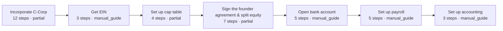

# Journeys — multi-process founder paths

A journey chains processes into a founder-visible path: start a company, hire, grant equity,
raise, launch, expand, exit.

**Current implementation:** the 24 process chains in `chains.json` in this directory
(incorporation → launch, the VC raise, month-end close, tax season, the agent-run back
office…), referencing 92 distinct processes from `processes/corpus.json` (counts computed from
the committed files, 2026-09-30). They render as playbooks at `/processes` and are driven
end-to-end by The Open Startup (`/virtual-startup`), which runs a simulated company through the
real corpus with every step routed agent / manual / human.

## What a chain record is

A chain is deliberately thin: an id, a name, a one-line tagline, and an ordered list of
process IDs that must already exist in `processes/corpus.json` — chains never invent steps.
The real `company-launch` record, in full:

```json
{
  "id": "company-launch",
  "name": "Company launch",
  "tagline": "Incorporate, get the EIN, put the founders and cap table on paper, open the bank account, turn on payroll and the books.",
  "taskIds": ["form_001", "form_002", "qs_051", "startup_002", "qs_023", "qs_063", "qs_073"]
}
```

## A real chain, resolved

The same `company-launch` chain with each `taskId` resolved against `processes/corpus.json`
(as committed 2026-09-30; step counts are each process's DAG node count, support level is its
agent ceiling):



Each box is itself a full process DAG — see the `form_001` diagram in `processes/README.md`
for what one box expands into.

## How the site consumes this directory

- `lib/processes.ts` `loadChains()` reads `chains.json` and cross-checks every `taskId`
  against the corpus; chain pages render at `/processes/chains/<id>` with the member DAGs
  stitched in order.
- The Open Startup (`/virtual-startup`) drives a simulated company through these chains —
  decisions pick which chains run, and every generated artifact is visibly SIMULATED.
- The ⌘K palette surfaces each chain by name and by the journey phrases people actually type
  ("raise a seed round", "launch on product hunt") via `data/search-aliases.json`.

**Stage 2 of the corpus lift (done 2026-09-28):** the chains moved here from
`data/process-chains.json`, byte-identical — paths only (`lib/processes.ts` `loadChains()` now
reads `journeys/chains.json`; loaders, fingerprints, and determinism gates unchanged).
Journey records referencing jurisdiction-scoped workflows from `processes/` when a leg is
legal-rigor territory (e.g. the equity-grant leg pointing at `equity.us-de.83b-election`)
remain future work.

## What you can contribute here

- **A new chain** — add an entry to `journeys/chains.json` linking existing process IDs from
  `processes/corpus.json` into a founder-visible path (a country-specific incorporation →
  launch sequence, a wind-down, a first-enterprise-deal path). Every referenced process must
  already exist; chains never invent steps.
- **Fixes to an existing chain** — reordering, a missing leg, or a better description, with
  the reasoning in the PR.

Gate for both: `pnpm test` (`lib/__tests__/processes.test.ts` loads and cross-checks every
chain against the corpus).
