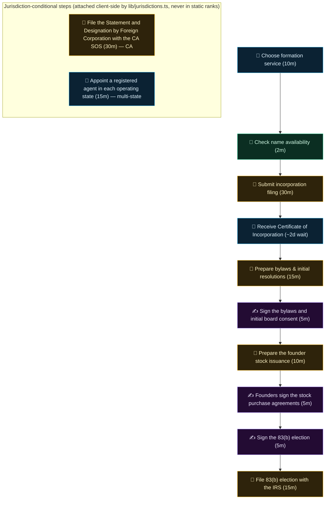

# Processes — human guides and machine-readable workflows

Two layers, deliberately separate:

1. **Jurisdiction-scoped workflows** (this tree, `processes/<domain>/<jurisdiction>/*.json`,
   contract in `schemas/process.schema.json`): source-backed legal/tax workflows with explicit
   applicability dimensions, dated editorial review, rule-card references, stop conditions, and
   a scoped human approval on every externally-effectful step. Validated by
   `lib/founderOps.ts` inside the normal test gates. The starter set is two demonstration US
   Delaware equity workflows (409A valuation review, 83(b) election) — status `demonstration`,
   not production-certified; see `governance/REVIEW_POLICY.md` for the maturity ladder.

2. **The operational corpus** (`corpus.json` in this directory, 123 processes rendered live at
   [ultrametric.ai/processes](https://ultrametric.ai/processes) — each process at
   `/processes/<id>` — contract in `schemas/operational-process.schema.json`):
   step-by-step operating DAGs with agent/manual/human routing, judged vendor rankings per
   step, agent ceilings, and time estimates. These are operating guides, not legal advice, and
   they carry no jurisdiction warranty — the site's jurisdiction toggle (`lib/jurisdictions.ts`)
   and geo scoping annotate where steps are US- or state-specific.

A process here may cite operational corpus pages for the how-to mechanics; the operational
corpus links back when a step crosses into fact-specific legal territory. The two layers keep
separate IDs and never silently substitute for each other. Stage 2 of the corpus lift
(2026-09-28) moved the operational corpus here from `data/processes.json`, byte-identical —
paths only: `lib/processes.ts` `loadProcesses()` reads `processes/corpus.json`, and the
founder-ops workflow validator (`lib/founderOps.ts`) deliberately skips `corpus.json` when it
walks this tree (the corpus has its own schema and gates). The two layers now live side by
side under this directory as promised.

## What a corpus record is

One record per founder process: identity and classification (`phase`, `cadence`,
`complexity`), an honest agent ceiling (`supportLevel` + `supportReason`), the vendors that can
run it, the step DAG, and geo scoping. A trimmed real record (`form_002`, Get EIN):

```jsonc
{
  "id": "form_002",
  "title": "Get EIN",
  "phase": "formation",
  "cadence": "once",
  "complexity": "simple",
  "supportLevel": "manual_guide",
  "supportReason": "IRS EIN application is a web form with no API. System provides step-by-step guidance and pre-fills company data.",
  "vendors": ["irs", "stripe_atlas", "firstbase", "legalzoom"],
  "dag": {
    "nodes": [
      { "id": "n2", "label": "Pre-fill EIN application data", "route": "agent", "estimatedMinutes": 1 },
      { "id": "n3", "label": "Complete IRS SS-4 form online", "route": "form", "estimatedMinutes": 10 },
      { "id": "n4", "label": "Store EIN in company records", "route": "agent", "estimatedMinutes": 1 }
    ],
    "edges": [{ "from": "n2", "to": "n3" }, { "from": "n3", "to": "n4" }]
  },
  "geoScope": "us",
  "geoNotes": [{ "country": "IN", "summary": "PAN and TAN … are allotted automatically as part of the SPICe+ incorporation filing…", "actionUrl": "https://www.incometax.gov.in/iec/foportal/" } /* …UK/DE/FR analogs trimmed */]
  // …contextNeeded, tags, time totals, annoyance/risk/growthImpact trimmed
}
```

Every step carries a route: `agent` (an agent can run it), `form` (a manual web form — no
API), `person` (human judgment or computer use), and `person` steps can additionally be marked
`legalSignature` — the true human floor, a legally required signature/attestation.

## Reversibility

Every process AND every step carries a required `reversibility` tier (founder ask 2026-09-30:
map what is irreversible, reversible, and "irreversible with pain"). The judgment test is
**"what does undoing actually take"** — never how risky or annoying the work is (that's `risk`
/ `annoyance`):

- **`reversible`** — freely undoable: drafts, configs, most SaaS setup, waits on third
  parties, internal governance paper a later consent supersedes. A routine external send whose
  correction costs nothing (a follow-up email) is reversible in practice.
- **`painful`** — irreversible with pain: undoable at real cost. Incorporating in the wrong
  state (re-domestication), entity conversion, switching payroll providers mid-year, migrating
  banks, breaking a lease, renaming the company, walking back a public announcement, unwinding
  an executed contract, withdrawing a government registration.
- **`irreversible`** — cannot be undone: dissolution filed, an 83(b) election filed (the
  missed window never reopens), equity issued and accepted, a wire sent, a refund processed,
  an employee terminated.

Curation rules: classify the **step's own act** — a "Receive the certificate" step commits
nothing (reversible) even though the filing before it did; a "Sign the X" step is reversible
while the paper is unfiled and unaccepted (the signed-but-unfiled 83(b)), and binding once
executed and accepted. The two levels are curated independently: a *painful* process can
contain one truly *irreversible* filing step (Incorporate C-Corp — the entity can be
dissolved, the filed 83(b) cannot be unfiled), and an *irreversible* process is mostly
reversible steps until the wire goes out. Irreversible is deliberately rare at both levels —
totality and distribution are pinned by `lib/__tests__/reversibility.test.ts`. No zod default
exists: an unclassified process or step fails the corpus parse.

## The artifact layer (typed inputs/outputs)

`artifacts.json` (founder depth wave part 2, 2026-10-01) is the vocabulary of canonical
business artifacts that flow BETWEEN processes — the EIN, the Certificate of Incorporation,
the bank account, the cap table, the 409A report, the payroll account. Each registry entry:
`id` (kebab-case), `label`, `description`, `producedBy` (the ONE canonical producer process),
optional `alsoProducedBy` (documented exceptions), optional `terminal: true`. On the corpus
side every process carries two required typed fields — `produces: string[]` and
`requires: string[]` (artifact ids) — and the specific step where an artifact comes into
existence is pinned with node-level `producesArtifact`. The `contextNeeded` prose stays the
human context; the typed layer is the machine truth, and `lib/processDeps.ts` builds the
company-level dependency DAG from it (process page "Needs / Produces" chips, the derived
topological ordering, and the committed `docs/TIMELINE-INVERSIONS.md` renumbering worklist).

**What qualifies as an artifact.** A nameable business thing a committed corpus step genuinely
brings into existence AND that at least one other process genuinely consumes — or, rarely, a
real terminal output nothing downstream reads (the filed 83(b), the dissolution certificate),
flagged `terminal`. Not artifacts: judgments, meetings, recurring acts ("payroll was run"),
or anything no committed step produces. The registry is sized from the corpus itself — no
invented artifacts, no aspirational vocabulary.

**The one-producer rule.** Every artifact names exactly one canonical producer (`producedBy`)
so the dependency graph stays a DAG with unambiguous edges. Where a second committed process
genuinely also births the artifact — the LLC route applies for its own EIN, the LLC→C-Corp
conversion re-issues the charter paper, the exec hire signs an offer — that process is listed
in `alsoProducedBy` and may carry the artifact in its `produces`; graph edges still point at
the canonical producer, and an exception page's "Produces" chip links back to the canonical
process.

**How to add one.** Add the registry entry; add the artifact to the producer's `produces` and
tag the birth step with `producesArtifact` (never on a jurisdiction-conditional node — those
are stripped from the default view); add it to at least one other process's `requires` (or
flag it `terminal` with the reason in the description). Gates: the corpus tests
(`lib/__tests__/processArtifacts.test.ts` — totality, one-producer, consumed-or-terminal;
`lib/__tests__/processDeps.test.ts` — acyclicity, resolvable edges, no self-requires), and
regenerate the derived report: `npx tsx scripts/generate-timeline-inversions.ts` (drift-tested
— a stale `docs/TIMELINE-INVERSIONS.md` fails the suite). Published schema:
`schemas/process-artifacts.schema.json` (generated from `ArtifactRegistrySchema` in
`lib/processes.ts` by `scripts/generate-corpus-schemas.ts`).

**Reported, not auto-fixed.** The derived topological ordering is compared against the curated
`timeOrder` founder timeline; every inversion (a consumer curated before its producer) is a
row in `docs/TIMELINE-INVERSIONS.md` — the founder's renumbering worklist, never a silent
re-sort.

## A real process DAG

This is `form_001` (Incorporate C-Corp) exactly as committed in `corpus.json` at
`a4b656235` (2026-09-30) — the mermaid below is generated from that record's `dag.nodes` and
`dag.edges`, nothing invented. Glyphs: 🤖 `agent` · 📝 `form` (manual web form) · 🧑 `person` ·
✍ a `person` step with `legalSignature` (legally required human signature).



## How the site consumes this directory

- `lib/processes.ts` `loadProcesses()` reads `corpus.json` at build time — it strips the
  jurisdiction-conditional nodes (they only ever render client-side via the `?juris=` toggle,
  so no judged number moves) and powers `/processes`, every `/processes/<slug>` page
  (`components/ProcessDag.tsx` renders the DAG above with the same route colors), the process
  rankings (`/rankings/processes/*`), and the open startup simulator at `/startup-sim`.
- `journeys/chains.json` links corpus process IDs into playbooks (see `journeys/README.md`).
- `lib/founderOps.ts` validates the jurisdiction-scoped workflow layer (`equity/us-de/*`)
  against `schemas/process.schema.json`, resolves its rule-card references into `rules/` and
  `sources/`, and exposes the exact-dimension planner (`planFounderOps`).

## What you can contribute here

- **A country analog for a process** — add a `geoNotes` entry to the process in
  `processes/corpus.json`: `{country, summary, actionUrl, actionLabel}` with a live, official
  actionUrl (Companies House, MCA/NSWS, Handelsregister, INPI…). This renders in the
  top-of-page geo banner and the "Outside the US" block. Gate: `pnpm test` (corpus loader +
  schema tests).
- **A new jurisdiction-scoped workflow** — copy `templates/process.json` into
  `processes/<domain>/<jurisdiction>/`, narrow the applicability dimensions, reference rule
  cards in `rules/<CODE>/`, gate every external effect on a named human approval, add a
  fictional fixture in `fixtures/`, and record honest maturity in `catalog/coverage.json`.
  Gate: `npx vitest run __tests__/founder-ops.test.ts`.
- **Corrections to an operational process** — step routing (agent / manual form / human),
  agent ceilings, or time estimates in `corpus.json`, with a source or reproduction for the
  claim. Gate: `pnpm test`.
- **An artifact or a typed dependency** — a missing `requires` a committed step genuinely
  consumes, a missing registry artifact a committed step genuinely produces, or a terminal
  flag that should be a real consumer. Follow "The artifact layer" rules above (one canonical
  producer, no invented artifacts), regenerate `docs/TIMELINE-INVERSIONS.md`. Gate:
  `pnpm test` (`processArtifacts` + `processDeps` suites).
